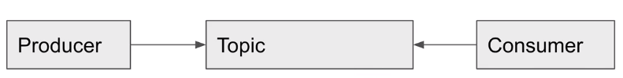

# Kafka

카프카란? `분산 이벤트 스트리밍 플랫폼` 이다. 여기서 이벤트 스트리밍이란 소스(`producer`)에서 목적지(`consumer`)까지 이벤트를 실시간으로 스트리밍하는 것을 의미한다.

카프카의 기본적인 구조는 Producer, Topic, Consumer 로 이루어져있는데, Queue 라고 생각하면 편하다.



Topic 에 데이터를 삽입할 수 있는 기능을 가진것이 `Producer` 이며, 반대로 Topic 에 삽입된 데이터를
가져갈 수 있는 것이 `Producer` 이다. 그래서 Kafka 는 소스(Producer) 에서 목적지(Consumer) 까지 데이터를 
실시간으로 스트리밍할 수 있도록 도와주는 플랫폼이라고 불리우는 것이다.

# Docker 로 kafka 테스트

## Docker 로 kafaka 셋팅

토픽 생성

```bash
$ docker exec -it kakfa kafka-topics.sh --bootstrap-server localhost:9092 --create --topic testTopic
```

프로듀서 실행 (> 가 뜨면 정상)

```bash
$ docker exec -it kakfa kafka-console-producer.sh --topic testTopic --broker-list 0.0.0.0:9092
```

컨슈머 실행 (아무것도 안뜨고 대기하면 정상)

```bash
$ docker exec -it kakfa kafka-console-consumer.sh --topic testTopic --bootstrap-server localhost:9092
```

producer 프롬프트에서 값을 보내면, consumer 프롬프트에서 값을 받을 수 있다. 


# Spring + Docker 로 kafka 테스트

## Spring 에서 kafaka 셋팅 (Producer 셋팅)

```java
@Configuration
public class KafkaProducerConfig {

    /**
     * Producer 인스턴스를 생성하는데 필요한 설정을 설정.
     * @return
     */
    @Bean
    public ProducerFactory<String, Long> producerFactory() {
        Map<String, Object> config = new HashMap<>();
        config.put(ProducerConfig.BOOTSTRAP_SERVERS_CONFIG, "localhost:9092");
        config.put(ProducerConfig.KEY_SERIALIZER_CLASS_CONFIG, StringSerializer.class);
        config.put(ProducerConfig.VALUE_SERIALIZER_CLASS_CONFIG, LongSerializer.class);
        return new DefaultKafkaProducerFactory<>(config);
    }

    /**
     * Topic 에 데이터를 전송하기 위해 사용할 KafkaTemplate 를 생성
     */
    @Bean
    public KafkaTemplate<String, Long> kafkaTemplate() {
        return new KafkaTemplate<>(producerFactory());
    }

}
```

### Topic 생성

Topic 생성

```bash
$ docker exec -it kakfa kafka-topics.sh --bootstrap-server localhost:9092 --create --topic coupon_create
``` 

### Consumer 실행

Topic 의 들어오는 데이터를 받아볼 수 있는 Consumer 를 실행

```bash
$ docker exec -it kakfa kafka-console-consumer.sh --topic coupon_create --bootstrap-server localhost:9092 --key-deserializer "org.apache.kafka.common.serialization.StringDeserializer" --value-deserializer "org.apache.kafka.common.serialization.LongDeserializer"
```

### 애플리케이션을 실행해서 Topic 에 데이터 전송

애플리케이션을 실행하면 Spring 에서 데이터가 Topic 으로 전송되고, Consumer 프롬프트에서
데이터가 들어오는 것을 확인할 수 있음.

